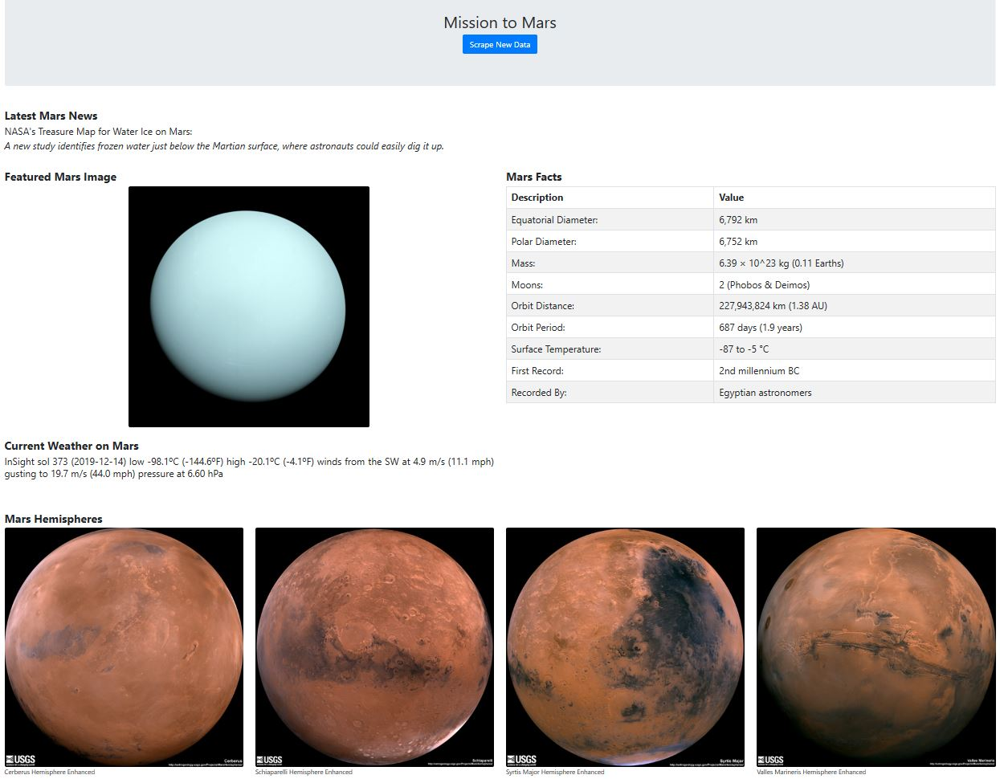

# Mission to Mars

## **Objective:**
The objective of this project is to build a web application using Flask that scrapes various websites for data on Mars and to display the information in a HTML page. The information on Mars is scraped from the web using BeautifulSoup, Pandas, and Splinter, saved in a Mongo database, then extracted and displayed in a HTML page. 

The information collected and presented includes: 
* Latest news title and paragraph text from the NASA Mars News site: https://mars.nasa.gov/news/?page=0&per_page=40&order=publish_date+desc%2Ccreated_at+desc&search=&category=19%2C165%2C184%2C204&blank_scope=Latest
* Featured Mars image from the JPL Space Image site: https://www.jpl.nasa.gov/spaceimages/?search=&category=Mars
* Weather on Mars from the Mars Weather twitter account: https://twitter.com/marswxreport?lang=en
* Facts about Mars from the Mars Facts site: https://space-facts.com/mars/
* Images of Mars’s hemispheres from the USGS Astrogeology site: https://astrogeology.usgs.gov/search/results?q=hemisphere+enhanced&k1=target&v1=Mars

## **Tools:**
1. Python - Flask, BeautifulSoup, Pandas, Splinter
2. MongoDB
3. HTML

## **Screenshot:**

